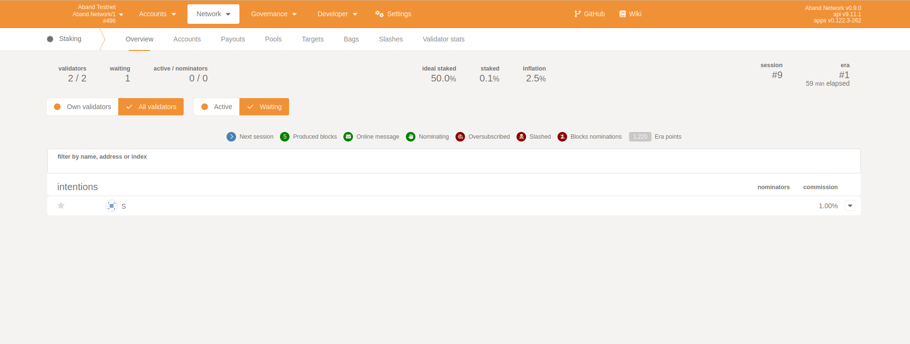
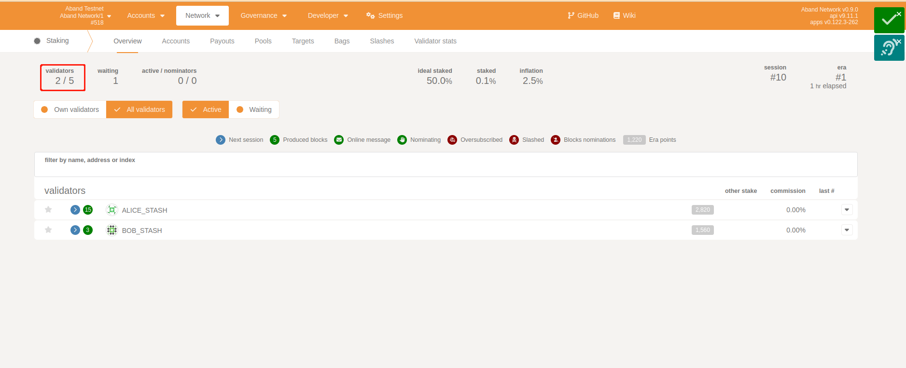

# 1. start a collator node
```commandline
./target/release/aband --chain local --collator --ws-port 9922 --base-path ./target/release/db -- --chain polkadot-launch/rococo-local-raw.json
```

# 2. Create stash and controller Account
click [https://polkadot.js.org/apps/?rpc=ws%3A%2F%2F127.0.0.1%3A9922#/accounts](https://polkadot.js.org/apps/?rpc=ws%3A%2F%2F127.0.0.1%3A9922#/accounts),
create `C` 和 `S`.
And transfer 5000 tokens to `C` and `S` respectively.

# 3. generate session-keys
click [https://polkadot.js.org/apps/?rpc=ws%3A%2F%2F127.0.0.1%3A9922#/rpc](https://polkadot.js.org/apps/?rpc=ws%3A%2F%2F127.0.0.1%3A9922#/rpc) `rotateKeys`,
and copy the keys.

# 4. `+ Validator`
 On [https://polkadot.js.org/apps/?rpc=ws%3A%2F%2F127.0.0.1%3A9922#/staking/actions](https://polkadot.js.org/apps/?rpc=ws%3A%2F%2F127.0.0.1%3A9922#/staking/actions), found `+ Validator` and click it,
follow the steps and paste the keys in 3.


After successful operation, we will find that `S` has been added in ***Waiting***,


# 5. Set validators count.

What we find is that the validators has reached `2/2` (100%),

Therefore, in order for the validator added above to be able to enter the validators set, we have increased the maximum number of validators.
On [https://polkadot.js.org/apps/?rpc=ws%3A%2F%2F127.0.0.1%3A9922#/sudo](https://polkadot.js.org/apps/?rpc=ws%3A%2F%2F127.0.0.1%3A9922#/sudo),
chose `staking`module,  `setValidatorCount`

validators count update successfully.

Waiting for the end of the era, we will find that 'S' has successfully entered the validators set and the collators set.


