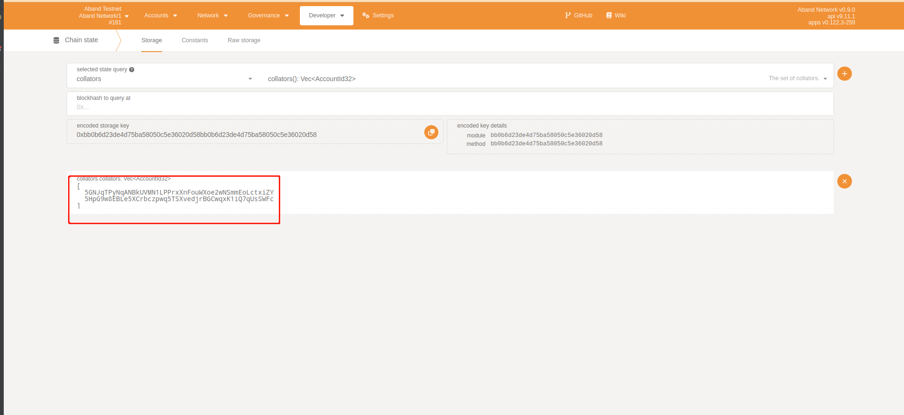
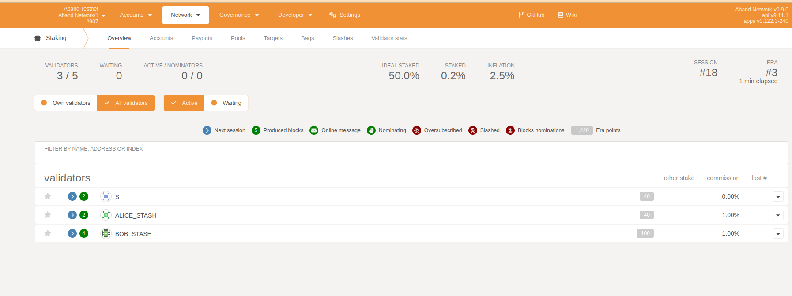

## 1. launch testnet
[launch your testnet](./launch-testnet.md)
## 2. Connect to node
[https://polkadot.js.org/apps/?rpc=ws%3A%2F%2F127.0.0.1%3A9944](https://polkadot.js.org/apps/?rpc=ws%3A%2F%2F127.0.0.1%3A9944)
## 3. Nimbus consensus generation block
On [chain-spec](https://github.com/Aband-Network/substrate-parachain-PoS-template/blob/main/node/src/chain_spec.rs#L179), We know that the collators of the  genesis  block are `Alice-Stash` and `Bob-Stash`.
In ***chain state***, We query 'collators' under the' collators' module and find that the collators are already `Alice-Stash` and `Bob-Stash`, indicating that the collators are successfully set.

In ***chain-info***, we will find that the number of blocks keeps increasing, and a block is issued in about 12 seconds, indicating that the block has been successfully issued.

In ***chain state***, we query 'author' in the 'authorInherent' module to know that it is `Alice-Stash` and `Bob-Stash` that are randomly pumping blocks.

## 4. Staking module related features
On [https://polkadot.js.org/apps/#/staking](https://polkadot.js.org/apps/#/staking),
We will find that the validators are `Alice-Stash 'and' Bob-Stash`, and the validator who generate the block will get the point.

Staking is fine if you click on anything else.
## 5. Add validator for PoS
[add validator](./add-validator.md)
## 6. ~~Add collator for PoA~~
[update collator](./update-collator.md)
> Only in the case of a PoA can the collator be updated.
> In the case of PoA, you can use staking-related functions, but the collators are no longer from the validators of the staking module.
> This is very useful for PoA parachains that want to reward collator nodes.
