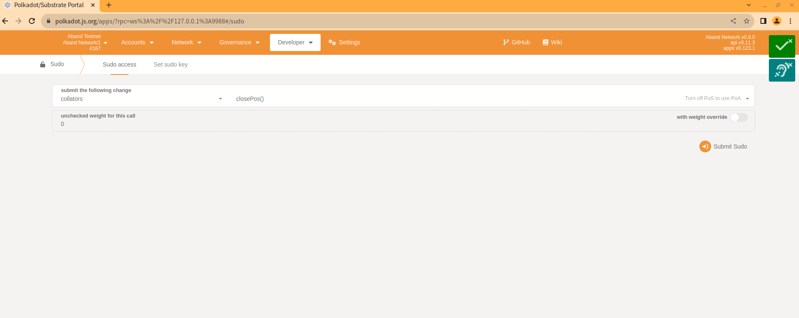
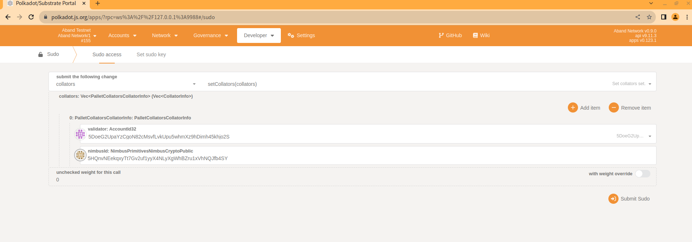
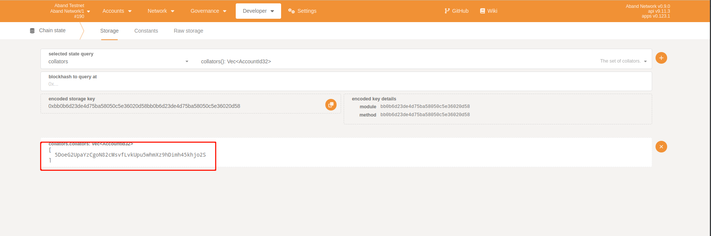
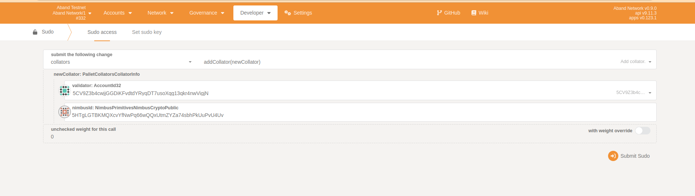
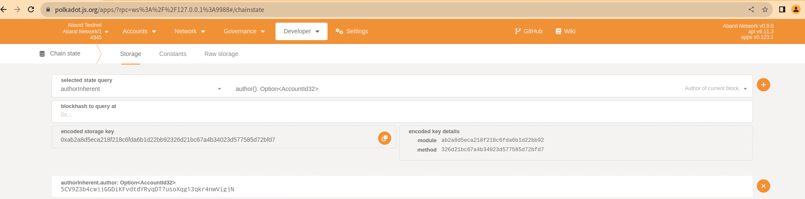
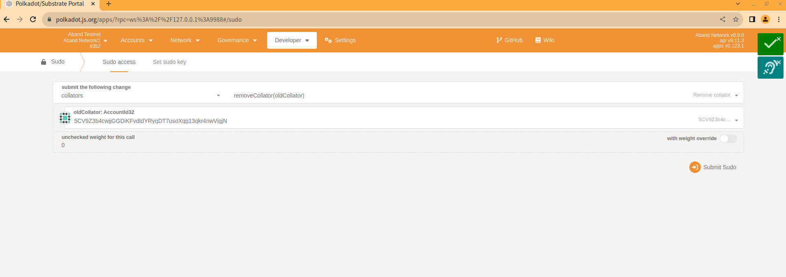
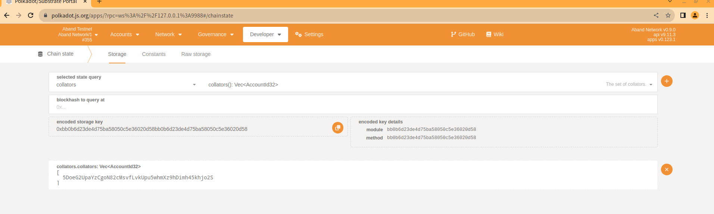
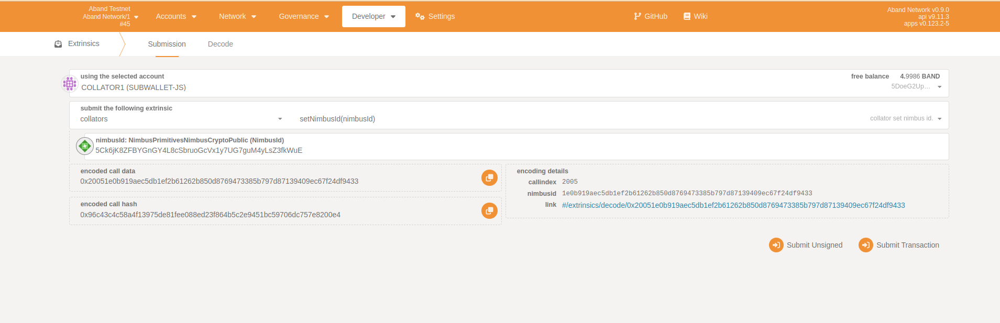
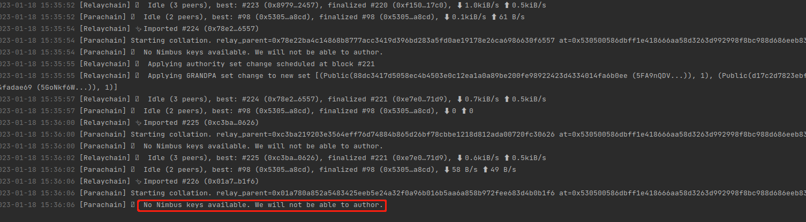
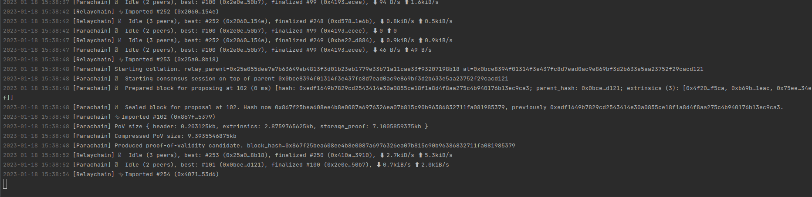

# Preparation
## 1. Generate Collators Accounts
- install subkey
	```commandline
	# Use the `--fast` flag to get the dependencies without needing to install the Substrate and Subkey binary
	curl https://getsubstrate.io -sSf | bash -s -- --fast
	# Install only `subkey`, at a specific version of the subkey crate
	cargo install --force subkey --git https://github.com/paritytech/substrate --version <SET VERSION> --locked
	```
- generate accounts。
	- Collator1
		```commandline

		subkey generate
		#Secret phrase:       lake evoke sunset canal shop render midnight trophy color pool special moral
		#  Network ID:        substrate
		#  Secret seed:       0x104abdf76ee66509e00981d2d8dbd3bfc88c5af3b91efd5bb63c24bdcbd0c8ea
		#  Public key (hex):  0x4cfbad2262d557661ec4f4d26e918fc588779114246c5219a53921298cd7e12b
		#  Account ID:        0x4cfbad2262d557661ec4f4d26e918fc588779114246c5219a53921298cd7e12b
		#  Public key (SS58): 5DoeG2UpaYzCgoN82cMsvfLvkUpu5whmXz9hDimh45khjo2S
		#  SS58 Address:      5DoeG2UpaYzCgoN82cMsvfLvkUpu5whmXz9hDimh45khjo2S

		subkey generate
		# nimbus id
		#Secret phrase:       box silent loyal solar poverty maximum leader sock check blast merge appear
		#  Network ID:        substrate
		#  Secret seed:       0x3d5ad53aa1f2533153fc575209ff69679f0ba207d5f1a7adab1eb57ab36f8e9f
		#  Public key (hex):  0xec7f1f1a400407edfab6f04686aa2c579f58e865073bb48042e49ef2f1b24649
		#  Account ID:        0xec7f1f1a400407edfab6f04686aa2c579f58e865073bb48042e49ef2f1b24649
		#  Public key (SS58): 5HQnvNEekqxyTt7Gv2uf1yyX4NLyXgWhBZru1xVhNQJfb4SY
		#  SS58 Address:      5HQnvNEekqxyTt7Gv2uf1yyX4NLyXgWhBZru1xVhNQJfb4SY
		```

	- Collator2

		```commandline
		subkey generate

		#Secret phrase:       unfair boil entire genre nerve follow stove abandon smoke evidence advance ozone
		#  Network ID:        substrate
		#  Secret seed:       0xee3431b997943b75150d998703d0d3701d5c5a38e9530e930179bc1ad79407fe
		#  Public key (hex):  0x12a46401f4189c3f075fe7b45ef9d7aff59471c99c94481cce19624597739e01
		#  Account ID:        0x12a46401f4189c3f075fe7b45ef9d7aff59471c99c94481cce19624597739e01
		#  Public key (SS58): 5CV9Z3b4cwjjGGDiKFvdtdYRyqDT7usoXqg13qkr4nwVigjN
		#  SS58 Address:      5CV9Z3b4cwjjGGDiKFvdtdYRyqDT7usoXqg13qkr4nwVigjN

		subkey generate
		# nimbus id
		#Secret phrase:       crawl segment flock they rib toss belt quality south tragic hurt deal
		#  Network ID:        substrate
		#  Secret seed:       0x027467c6d8bd85447f7cba234a2601e95e0f32530475629042bb1e2fbca043cf
		#  Public key (hex):  0xeeb2ae46fbfb6970f26fdb43eec4112f25410e96a65d007485e103bdf0957105
		#  Account ID:        0xeeb2ae46fbfb6970f26fdb43eec4112f25410e96a65d007485e103bdf0957105
		#  Public key (SS58): 5HTgLGTBKMQXcvYfNwPq66wQQxUtmZYZa74sbhPkUuPvU4Uv
		#  SS58 Address:      5HTgLGTBKMQXcvYfNwPq66wQQxUtmZYZa74sbhPkUuPvU4Uv

		```

## 2. Start Collators Node
### Start Collator1 Node
- insert nimbus key
	```commandline
	./target/release/aband key insert  --base-path polkadot-launch/db-collator1  --scheme Sr25519 --suri "box silent loyal solar poverty maximum leader sock check blast merge appear" --key-type nmbs
	```
- start node
	```commandline
	./target/release/aband --chain local --collator --ws-port 9944 --base-path polkadot-launch/db-collator1 -- --chain polkadot-launch/rococo-local-raw.json
	```
### Start Collator2 Node
- insert nimbus key
	```commandline
	./target/release/aband key insert  --base-path polkadot-launch/db-collator2  --scheme Sr25519 --suri "crawl segment flock they rib toss belt quality south tragic hurt deal" --key-type nmbs
	```
- start node
	```commandline
	./target/release/aband --chain local --collator --ws-port 9999 --base-path polkadot-launch/db-collator2 -- --chain polkadot-launch/rococo-local-raw.json
	```

***
# Manual test

## 1. Close POS

## 2. set_collator
Here we set `collator1` as the collator node.

`validator` **5DoeG2UpaYzCgoN82cMsvfLvkUpu5whmXz9hDimh45khjo2S**,
`nimbus id` **5HQnvNEekqxyTt7Gv2uf1yyX4NLyXgWhBZru1xVhNQJfb4SY**.

[https://polkadot.js.org/apps/?rpc=ws%3A%2F%2F127.0.0.1%3A9944#/sudo](https://polkadot.js.org/apps/?rpc=ws%3A%2F%2F127.0.0.1%3A9944#/sudo)


Now collators

## 3. add collator
Add Collator2 to collators.

`validator` **5CV9Z3b4cwjjGGDiKFvdtdYRyqDT7usoXqg13qkr4nwVigjN**,
`nimbus id` **5HTgLGTBKMQXcvYfNwPq66wQQxUtmZYZa74sbhPkUuPvU4Uv**,

[https://polkadot.js.org/apps/?rpc=ws%3A%2F%2F127.0.0.1%3A9944#/sudo](https://polkadot.js.org/apps/?rpc=ws%3A%2F%2F127.0.0.1%3A9944#/sudo)

`Collator2` generate Block.


## 3. remove collator
Remove Collator2 from collators.

collators


## 4. set nimbus id
```commandline
subkey generate
#Secret phrase:       notable replace crime okay hold tower stable parrot people puppy ecology crush
#  Network ID:        substrate
#  Secret seed:       0xa747941df265223b93be0e6d13db4f1a4f9c0f5a9aaffbc839b954ac4cab75c3
#  Public key (hex):  0x1e0b919aec5db1ef2b61262b850d8769473385b797d87139409ec67f24df9433
#  Account ID:        0x1e0b919aec5db1ef2b61262b850d8769473385b797d87139409ec67f24df9433
#  Public key (SS58): 5Ck6jK8ZFBYGnGY4L8cSbruoGcVx1y7UG7guM4yLsZ3fkWuE
#  SS58 Address:      5Ck6jK8ZFBYGnGY4L8cSbruoGcVx1y7UG7guM4yLsZ3fkWuE

```
Update Collator1's `nimbus id` to **5Ck6jK8ZFBYGnGY4L8cSbruoGcVx1y7UG7guM4yLsZ3fkWuE**,


remove old nimbus in keystore
```commandline
rm polkadot-launch/db-collator1/chains/aband_testnet/keystore/6e6d6273ec7f1f1a400407edfab6f04686aa2c579f58e865073bb48042e49ef2f1b24649
```
No block is generated on the node

Execute a command
```commandline
./target/release/aband key insert  --base-path polkadot-launch/db-collator1  --scheme Sr25519 --suri "notable replace crime okay hold tower stable parrot people puppy ecology crush" --key-type nmbs
```
reblock



